# GigFlow

A full-stack implementation of a freelance marketplace where users can post jobs (Gigs), bid on them, and handle hiring with transactional integrity and real-time updates.

## 🚀 Key Features

- **Project Posting**: Clients can post, edit, and withdraw job listings.
- **Bidding System**: Freelancers can place bids, edit them, or withdraw.
- **Atomic Hiring (Bonus 1)**: Robust hiring logic using **MongoDB Transactions** to prevent race conditions (e.g., ensuring no over-hiring for limited vacancies).
- **Real-time Notifications (Bonus 2)**: Instant "You're Hired" alerts using **Socket.io**.
- **User Profiles**: Update bio, skills, and contact information.
- **Professional UI**: Thread-style cards, particle cursor effects, and responsive design with Tailwind CSS.

## 🛠️ Tech Stack

- **Frontend**: React (Vite), Tailwind CSS, Socket.io-client
- **Backend**: Node.js, Express, MongoDB (Mongoose), Socket.io
- **Security**: JWT Authentication (HttpOnly Cookies), BCrypt password hashing

## 📦 Run Locally

### Prerequisites
- Node.js installed
- MongoDB URI (local or Atlas)

### 1. Server Setup
```bash
cd server
cp .env.example .env
# Add your MONGO_URI and JWT_KEY to .env
npm install
npm run dev
```
_Server runs on port 8800_

### 2. Client Setup
```bash
cd client
npm install
npm run dev
```
_Client runs on port 5173_

## 📝 Usage

1. **Register** two accounts: one as a Client, one as a Freelancer.
2. **Post a Job** from the Client account.
3. **Login as Freelancer**, find the job, and place a bid.
4. **Login as Client**, view the job details, and click "Hire" on the bid.

## 📸 Workflow Demo

A step-by-step walkthrough of the application workflow.
**Roles:**
- **Client**: Bhuvan
- **Freelancer**: Venkat

### 1. Home & Login

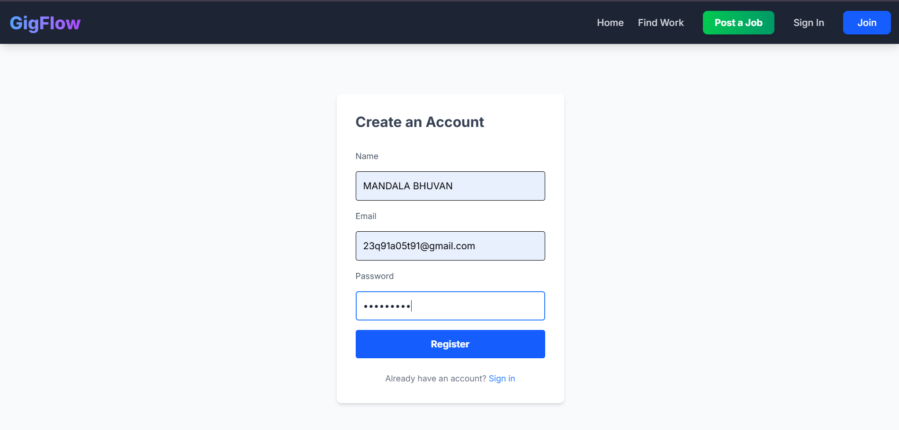
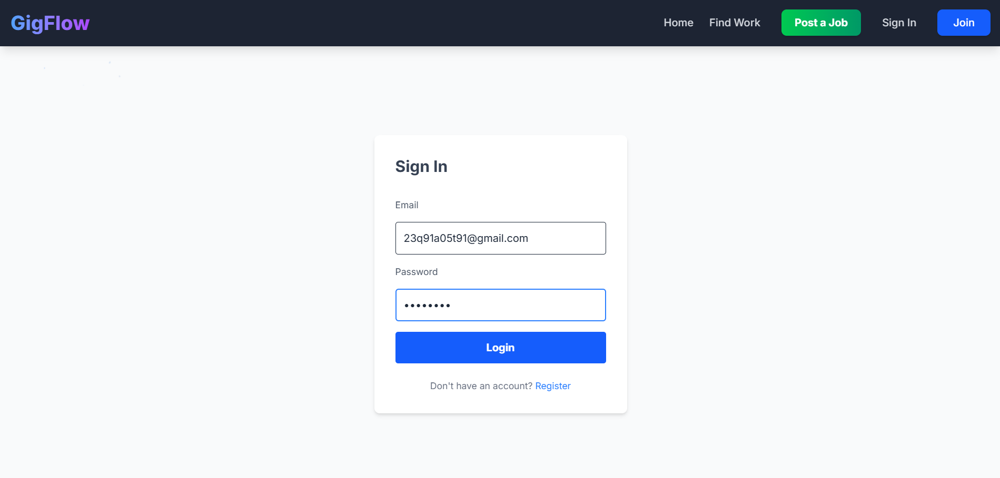

### 2. Client Dashboard & Posting
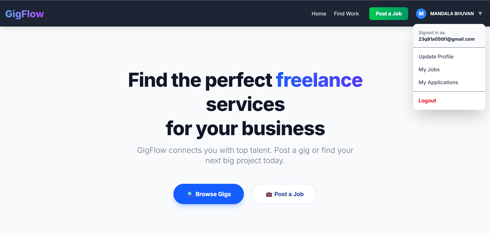
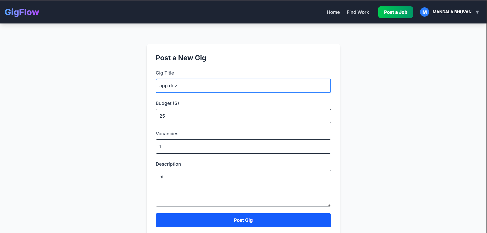

### 3. Freelancer Bidding
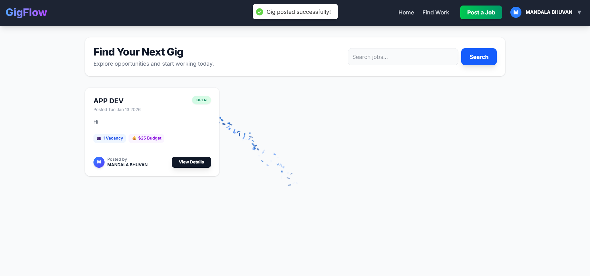
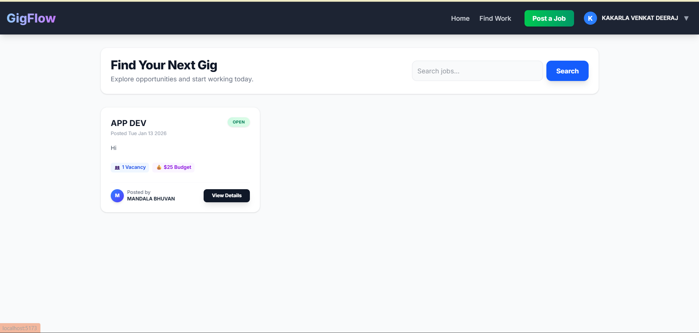
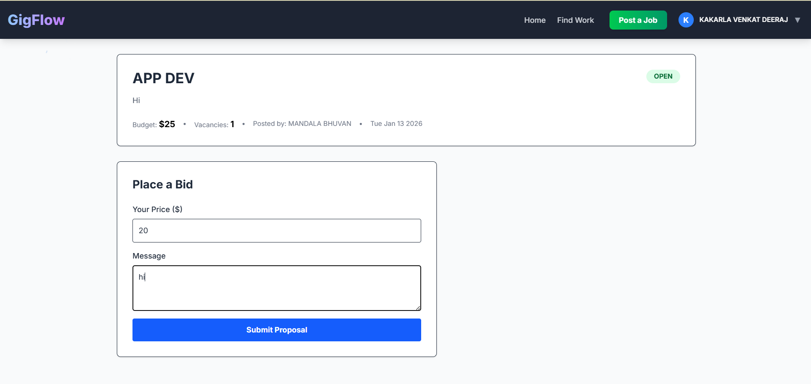
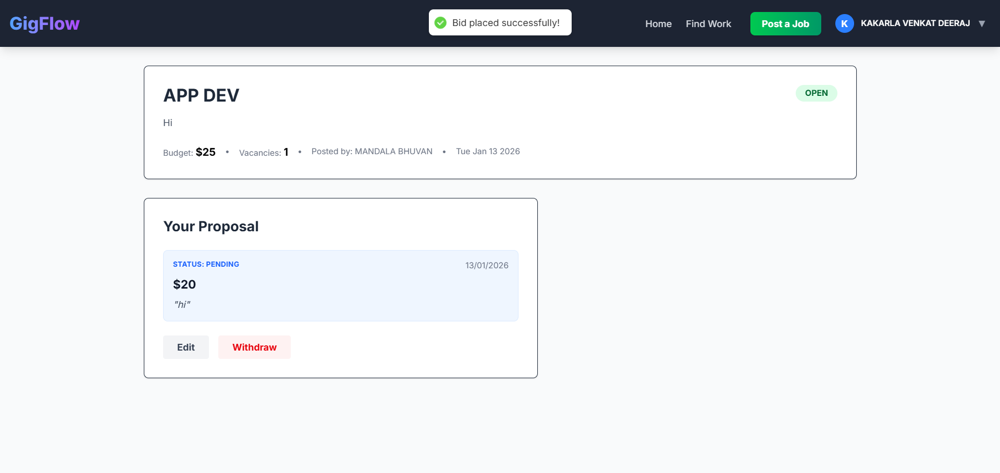

### 4. Hiring & Real-time Updates
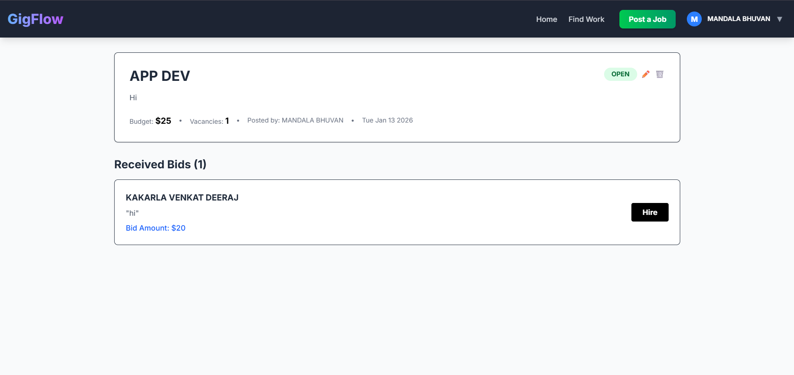

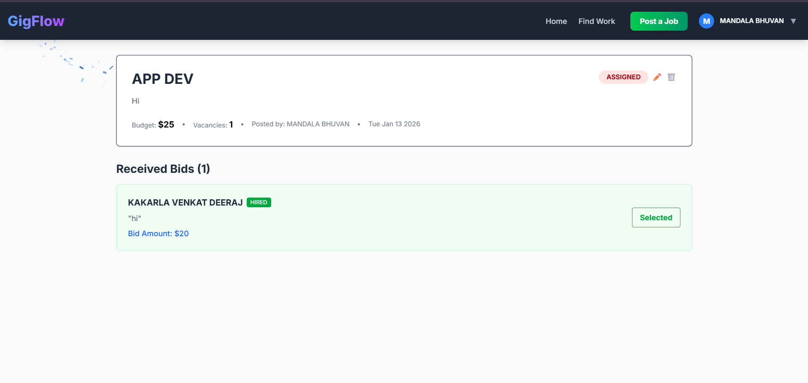
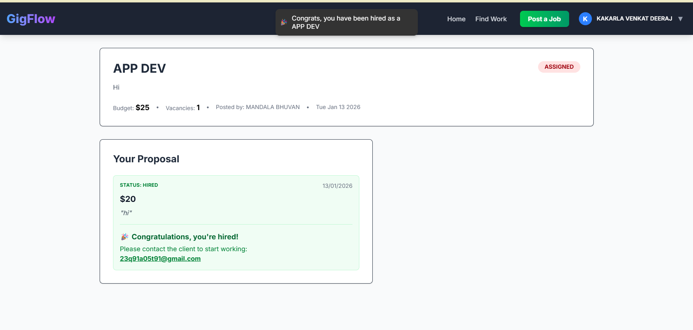
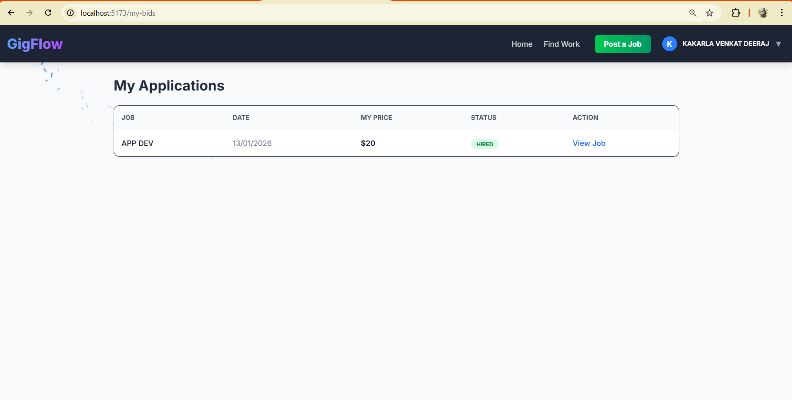
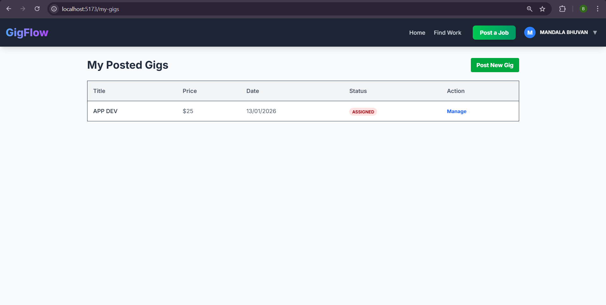

## 🗄️ Database Schemas (MongoDB)

### Users Schema


### Gigs Schema


### Bids Schema


